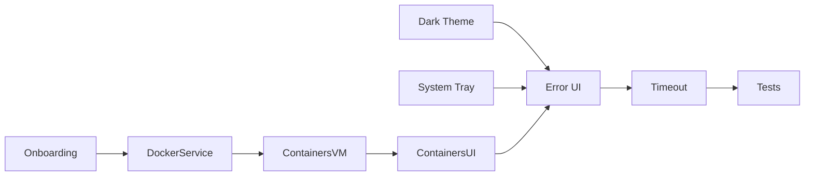

# Colimator MVP Task Plan

> **Purpose:** Structured task list for AI agents completing the Colimator MVP.  
> **Created:** 2025-12-08  
> **Reference:** See `prd.md` for requirements, `handoff.md` for context.

---

## Overview

Colimator is a Compose Multiplatform desktop app for managing Colima VMs and Docker containers on macOS. The **skeleton is complete** (Dashboard with Start/Stop/Refresh). The following tasks complete the MVP per `prd.md`.

---

## Phase 1: Core Infrastructure

### Task 1.1: Dark Theme Implementation

**Goal:** Implement developer-optimized dark theme per PRD Section 5.

**Files to create/modify:**

- `commonMain/kotlin/com/colimator/ui/theme/Theme.kt` [NEW]
- `commonMain/kotlin/com/colimator/App.kt` [MODIFY]

**Implementation steps:**

1. Create `Theme.kt` with custom `darkColorScheme()`:
   ```kotlin
   val ColimatorDarkColors = darkColorScheme(
       primary = Color(0xFF90CAF9),
       surface = Color(0xFF1E1E1E),
       background = Color(0xFF121212),
       // ... complete scheme
   )
   ```
2. Wrap `MaterialTheme` in `App.kt` with custom colors
3. Ensure all text has sufficient contrast

**Verification:** Run app, confirm dark theme applied, no legibility issues.

---

### Task 1.2: Onboarding / Dependency Check

**Goal:** Verify `colima` and `docker` are installed on launch (PRD 4.3).

**Files to create/modify:**

- `commonMain/kotlin/com/colimator/ui/OnboardingScreen.kt` [NEW]
- `commonMain/kotlin/com/colimator/viewmodel/OnboardingViewModel.kt` [NEW]
- `commonMain/kotlin/com/colimator/service/DockerService.kt` [NEW] (basic `isInstalled()`)
- `desktopMain/kotlin/com/colimator/main.kt` [MODIFY]
- `commonMain/kotlin/com/colimator/App.kt` [MODIFY]

**Implementation steps:**

1. Create `DockerService.isInstalled()` using `which docker` or `docker --version`
2. Create `OnboardingViewModel` to check both `ColimaService.isInstalled()` and `DockerService.isInstalled()`
3. Create `OnboardingScreen.kt`:
   - Show loading spinner during check
   - If both present → proceed to Dashboard
   - If missing → show alert with instructions, exit button
4. Modify `App.kt` to show `OnboardingScreen` first, then main app

**Verification:**

- Rename `colima` temporarily → app shows alert
- Restore → app proceeds to Dashboard

---

## Phase 2: System Tray Integration

### Task 2.1: System Tray Icon

**Goal:** Persistent macOS menu bar icon with quick actions (PRD 4.3).

**Files to create/modify:**

- `desktopMain/kotlin/com/colimator/main.kt` [MODIFY]
- `composeApp/src/desktopMain/resources/tray_icon.png` [NEW] - 22x22 PNG

**Implementation steps:**

1. Add tray icon resource (22x22 PNG, template-style for macOS)
2. Implement `SystemTray` in `main.kt`:
   ```kotlin
   val tray = SystemTray.getSystemTray()
   val icon = ImageIO.read(resource("tray_icon.png"))
   val popup = PopupMenu().apply {
       add(MenuItem("Start Colima").apply { addActionListener { /* startVm */ } })
       add(MenuItem("Stop Colima").apply { addActionListener { /* stopVm */ } })
       addSeparator()
       add(MenuItem("Quit").apply { addActionListener { exitApplication() } })
   }
   val trayIcon = TrayIcon(icon, "Colimator", popup)
   tray.add(trayIcon)
   ```
3. Left-click: toggle window visibility
4. Sync tray menu state with VM status (grey out Start if Running, etc.)

**Verification:**

- Tray icon visible in menu bar
- Right-click shows menu with working Start/Stop/Quit
- Window toggles on left-click

---

## Phase 3: Container Management

### Task 3.1: DockerService Implementation

**Goal:** Service layer for Docker container operations (PRD 4.2).

**Files to create/modify:**

- `commonMain/kotlin/com/colimator/service/DockerService.kt` [NEW or MODIFY if created in 1.2]
- `commonMain/kotlin/com/colimator/model/Container.kt` [NEW]

**Implementation steps:**

1. Create `Container` data class:
   ```kotlin
   @Serializable
   data class Container(
       @SerialName("ID") val id: String,
       @SerialName("Names") val names: String,
       @SerialName("Image") val image: String,
       @SerialName("Status") val status: String,
       @SerialName("Ports") val ports: String,
       @SerialName("State") val state: String  // "running", "exited", etc.
   )
   ```
2. Implement in `DockerService`:
   - `suspend fun listContainers(): List<Container>` — parse `docker ps -a --format json`
   - `suspend fun startContainer(id: String): CommandResult`
   - `suspend fun stopContainer(id: String): CommandResult`
   - `suspend fun removeContainer(id: String): CommandResult`

**Verification:** Unit tests mocking `ShellExecutor` with sample JSON output.

---

### Task 3.2: ContainersViewModel

**Goal:** ViewModel for container list state management.

**Files to create/modify:**

- `commonMain/kotlin/com/colimator/viewmodel/ContainersViewModel.kt` [NEW]

**Implementation steps:**

1. Create state class:
   ```kotlin
   data class ContainersState(
       val containers: List<Container> = emptyList(),
       val isLoading: Boolean = false,
       val error: String? = null
   )
   ```
2. Implement `ContainersViewModel(dockerService: DockerService) : BaseViewModel()`:
   - `val state: StateFlow<ContainersState>`
   - `fun refresh()` — fetch containers, update state
   - `fun startContainer(id)`, `stopContainer(id)`, `removeContainer(id)`
3. Handle errors gracefully → set `error` in state

**Verification:** Unit tests with mocked `DockerService`.

---

### Task 3.3: Containers Screen UI

**Goal:** Replace placeholder with functional container list (PRD 4.2).

**Files to create/modify:**

- `commonMain/kotlin/com/colimator/ui/ContainersScreen.kt` [NEW]
- `commonMain/kotlin/com/colimator/App.kt` [MODIFY]
- `desktopMain/kotlin/com/colimator/main.kt` [MODIFY] — add DI for ContainersViewModel

**Implementation steps:**

1. Create `ContainersScreen.kt`:
   - LazyColumn of containers
   - Each row: Name, Image, Status indicator (green/red), Ports
   - Action buttons: ▶️ Start, ⏹ Stop, 🗑 Delete
   - Refresh button in top bar
   - "No containers" empty state
2. Wire up navigation in `App.kt`
3. Inject `ContainersViewModel` in `main.kt`

**UI Reference:**

```
┌─────────────────────────────────────────────────┐
│  Containers                        [🔄 Refresh] │
├─────────────────────────────────────────────────┤
│ 🟢 nginx:latest          nginx-web    80:80    │ [Stop] [Delete]
│ 🔴 postgres:15           my-db        5432     │ [Start] [Delete]
│ 🟢 redis:alpine          cache        6379     │ [Stop] [Delete]
└─────────────────────────────────────────────────┘
```

**Verification:** Run app with Docker containers running, verify list displays correctly.

---

## Phase 4: Error Handling & Polish

### Task 4.1: Error State UI

**Goal:** User-visible error feedback.

**Files to modify:**

- `commonMain/kotlin/com/colimator/viewmodel/DashboardViewModel.kt`
- `commonMain/kotlin/com/colimator/viewmodel/ContainersViewModel.kt`
- `commonMain/kotlin/com/colimator/ui/DashboardScreen.kt`
- `commonMain/kotlin/com/colimator/ui/ContainersScreen.kt`

**Implementation steps:**

1. Add `error: String?` to all ViewModel states
2. Set error on failure: `_state.update { it.copy(error = result.stderr) }`
3. Show Snackbar or AlertDialog when error is non-null
4. Clear error on dismiss or retry

---

### Task 4.2: Timeout Handling

**Goal:** Better UX for long-running commands.

**Files to modify:**

- `desktopMain/kotlin/com/colimator/service/JvmShellExecutor.kt`
- `commonMain/kotlin/com/colimator/viewmodel/DashboardViewModel.kt`

**Implementation steps:**

1. Add configurable timeout parameter to `execute()`
2. For `colima start`, use longer timeout (180s)
3. Show progress indicator during long operations
4. Allow cancellation if possible

---

### Task 4.3: Unit Tests

**Goal:** Test coverage for services and ViewModels.

**Files to create:**

- `commonTest/kotlin/com/colimator/service/ColimaServiceTest.kt` [NEW]
- `commonTest/kotlin/com/colimator/service/DockerServiceTest.kt` [NEW]
- `commonTest/kotlin/com/colimator/viewmodel/DashboardViewModelTest.kt` [NEW]

**Implementation steps:**

1. Create mock `ShellExecutor` returning predefined outputs
2. Test happy path and error cases for each service
3. Test ViewModel state transitions

---

## Task Dependencies



---

## Quick Reference

| Task                    | Estimated Effort | Priority |
| ----------------------- | ---------------- | -------- |
| 1.1 Dark Theme          | Small            | High     |
| 1.2 Onboarding          | Medium           | High     |
| 2.1 System Tray         | Medium           | High     |
| 3.1 DockerService       | Medium           | High     |
| 3.2 ContainersViewModel | Small            | High     |
| 3.3 ContainersScreen    | Medium           | High     |
| 4.1 Error UI            | Small            | Medium   |
| 4.2 Timeout Handling    | Small            | Medium   |
| 4.3 Unit Tests          | Medium           | Medium   |
